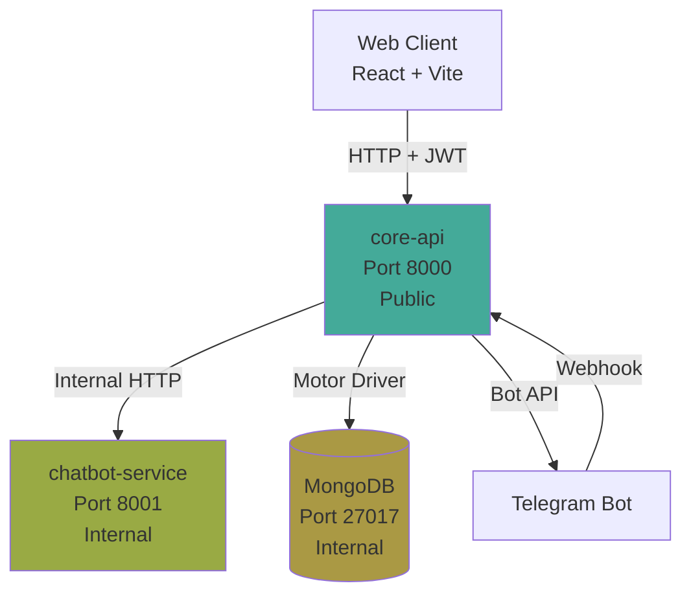
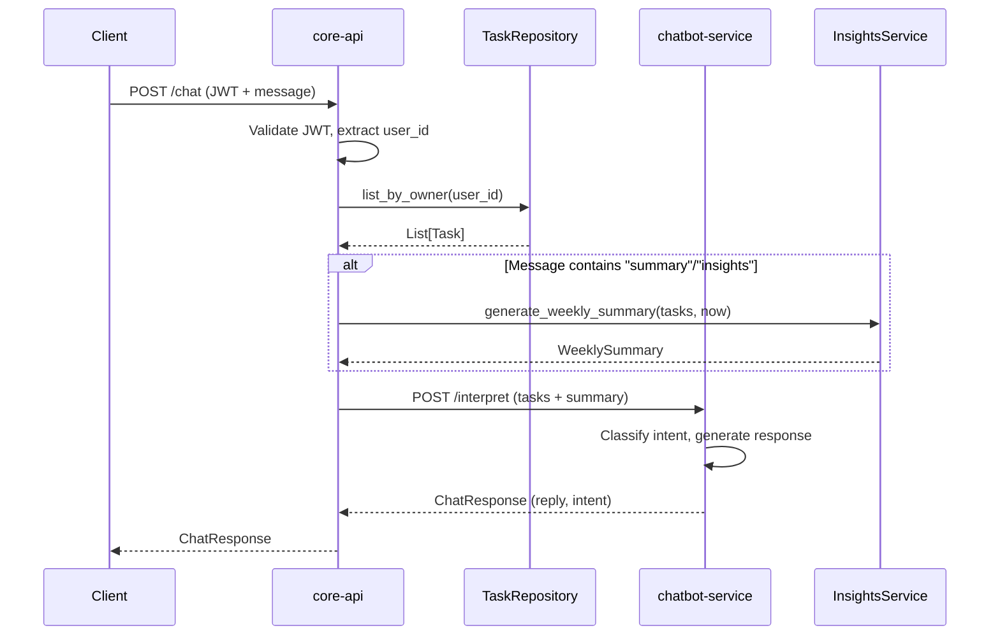
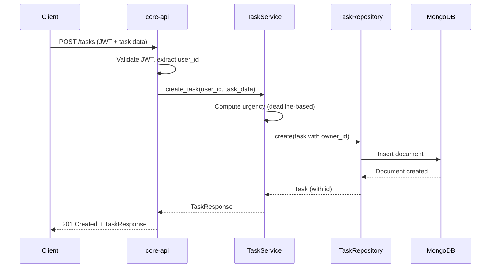

# TASKGENIUS Project Map

## Executive Summary

TASKGENIUS is a task management platform with AI-powered insights and conversational interfaces. The system follows a clean architecture with strict service boundaries: **core-api** is the single public-facing backend and system of record, **chatbot-service** is an internal read-only conversational facade, and **mongodb** is an internal database accessible only by core-api. The architecture enforces that all data access and mutations flow through core-api, while chatbot-service provides intent classification and conversational responses without direct database access. A React frontend client exists in `packages/client` but is not included in docker-compose.

## Repository Structure Map

```
TaskGenius/
├── services/
│   ├── core-api/              # Primary backend service (FastAPI)
│   │   ├── app/               # Application code
│   │   │   ├── auth/         # Authentication module (JWT, user management)
│   │   │   ├── tasks/        # Task CRUD and business logic
│   │   │   ├── insights/     # Weekly insights summary generation
│   │   │   ├── chat/         # Chat orchestration (calls chatbot-service)
│   │   │   ├── telegram/     # Telegram webhook and messaging adapter
│   │   │   ├── main.py       # FastAPI app bootstrap
│   │   │   ├── config.py     # Environment-based configuration
│   │   │   ├── database.py   # MongoDB connection management
│   │   │   └── security.py   # Security validation (Phase 6)
│   │   ├── tests/            # Test suite (87 tests, CI-safe)
│   │   ├── Dockerfile        # Container build definition
│   │   └── requirements.txt  # Python dependencies
│   │
│   └── chatbot-service/       # Internal conversational service (FastAPI)
│       ├── app/              # Application code
│       │   ├── router.py    # /interpret endpoint
│       │   ├── service.py   # Intent classification and response generation
│       │   ├── schemas.py   # Request/response models
│       │   └── main.py      # FastAPI app bootstrap
│       ├── tests/           # Test suite (13 tests, CI-safe)
│       ├── Dockerfile       # Container build definition
│       └── requirements.txt # Python dependencies
│
├── packages/
│   └── client/              # React frontend (TypeScript + Vite)
│       ├── src/
│       │   ├── api/         # API client code
│       │   ├── components/  # React components
│       │   ├── pages/       # Page components
│       │   └── routes/      # Routing configuration
│       └── package.json     # Node.js dependencies
│
├── shared/
│   └── contracts/
│       └── enums.json       # Shared enum definitions (immutable contract)
│
├── phases/                  # Phase implementation summaries
│   └── phase-*.md          # Historical phase documentation
│
├── docs/                    # Project documentation
│   └── *.md                # Architecture, requirements, specs
│
└── docker-compose.yml       # Multi-container orchestration
```

### Folder Purposes

- **services/core-api**: System of record; handles all authentication, task persistence, insights generation, and external integrations. Only service that accesses MongoDB.
- **services/chatbot-service**: Read-only conversational facade; provides intent classification and response generation. Never accesses databases or mutates state.
- **packages/client**: React frontend application (not containerized in docker-compose; runs separately via Vite dev server).
- **shared/contracts**: Immutable enum definitions shared across services to ensure consistency.
- **phases/**: Historical documentation of phased implementation (treat as stability contracts).
- **docs/**: Project documentation including architecture, requirements, and specifications.

## Services & Responsibilities

### core-api (services/core-api)

**What it does:**
- Authenticates users (JWT-based)
- Manages task CRUD operations with ownership enforcement
- Generates weekly insights summaries from task data
- Orchestrates chat interactions (fetches user data, calls chatbot-service)
- Handles Telegram webhook events and sends responses
- Enforces security policies (CORS, input validation, secret management)

**What it must NOT do:**
- Never bypasses authentication/authorization
- Never exposes internal services (chatbot-service, mongodb) publicly
- Never allows direct database access from other services

**Key entrypoints:**
- `app/main.py`: FastAPI application bootstrap, router registration, middleware setup
- `app/config.py`: Environment variable configuration
- `app/database.py`: MongoDB connection lifecycle

**Key modules:**
- `app/auth/`: User registration, login, JWT validation (`router.py`, `service.py`, `dependencies.py`)
- `app/tasks/`: Task CRUD, urgency computation, ownership enforcement (`router.py`, `service.py`, `repository.py`)
- `app/insights/`: Weekly summary generation (read-only analytical facade)
- `app/chat/`: Chat orchestration, calls chatbot-service with user context
- `app/telegram/`: Telegram webhook handler, adapter for Bot API, user mapping
- `app/security.py`: Startup security validation

### chatbot-service (services/chatbot-service)

**What it does:**
- Classifies user intents (list_tasks, get_insights, create_task, help, unknown)
- Generates conversational responses based on provided context
- Returns structured responses with intent and suggestions

**What it must NOT do:**
- Never accesses MongoDB directly
- Never mutates application state
- Never calls core-api directly (receives data from core-api)
- Never bypasses core-api for any data operations

**Key entrypoints:**
- `app/main.py`: FastAPI application bootstrap, router registration
- `app/config.py`: Environment variable configuration

**Key modules:**
- `app/router.py`: `/interpret` endpoint (POST)
- `app/service.py`: Intent classification and response generation logic
- `app/schemas.py`: Request/response models

## Communication Flows

### 1. Basic Request/Response Flow (Client → core-api)

**Flow:**
1. Client sends HTTP request to core-api (port 8000)
2. CORS middleware validates origin
3. For protected routes: JWT validation via `get_current_user` dependency
4. Router delegates to service layer
5. Service performs business logic
6. Response returned to client

**Authorization:** JWT token in `Authorization: Bearer <token>` header, validated in `app/auth/dependencies.py`

**State changes:** Only in task CRUD operations (create, update, delete)

**Side effects:** Database writes (MongoDB), external API calls (Telegram Bot API)

### 2. Task CRUD Flow (core-api ↔ MongoDB)

**Flow:**
1. Client → `POST /tasks` (authenticated)
2. `app/tasks/router.py` validates request via Pydantic schema
3. `get_current_user` extracts user_id from JWT
4. `TaskService` computes derived urgency
5. `TaskRepository` (MongoDB) persists task with `owner_id`
6. Response includes computed urgency

**Authorization:** User ID from JWT enforces ownership; repository queries scoped by `owner_id`

**State changes:** Task created/updated/deleted in MongoDB

**Side effects:** None (pure database operation)

### 3. Insights Flow (Read-Only Analysis)

**Flow:**
1. Client → `GET /insights/weekly` (authenticated)
2. `app/insights/router.py` extracts user_id from JWT
3. `TaskRepository.list_by_owner()` fetches user's tasks
4. `InsightsService.generate_weekly_summary()` computes summary (deterministic, no DB writes)
5. Returns structured summary (completed, high_priority, upcoming, overdue)

**Authorization:** User ID from JWT ensures only own tasks included

**State changes:** None (read-only)

**Side effects:** None

### 4. Chat Facade Flow (Client → core-api → chatbot-service)

**Flow:**
1. Client → `POST /chat` (authenticated, message in body)
2. `app/chat/router.py` extracts user_id from JWT
3. `ChatService.process_message()`:
   - Fetches user's tasks via `TaskRepository`
   - Optionally generates weekly summary if message contains keywords
   - Builds request payload with tasks and summary
   - Calls `chatbot-service:8001/interpret` via HTTP
4. `chatbot-service` classifies intent and generates response
5. `ChatService` returns response to client

**Authorization:** User ID from JWT ensures only own tasks sent to chatbot-service

**State changes:** None (chat flow is read-only)

**Side effects:** HTTP call to chatbot-service (internal network)

### 5. Telegram Flow (Telegram → core-api → chatbot-service → Telegram)

**Flow:**
1. Telegram sends webhook → `POST /telegram/webhook` (no auth required)
2. `app/telegram/router.py` receives `TelegramUpdate` payload
3. `TelegramService.process_webhook_update()`:
   - Extracts Telegram user ID and message text
   - Maps Telegram user ID to application user ID (in-memory, extensible)
   - Routes message through `ChatService.process_message()` (reuses chat flow)
   - Receives conversational response
4. `TelegramAdapter.send_message()` calls Telegram Bot API to send response

**Authorization:** User mapping required (Telegram user must be linked to app user)

**State changes:** None (Telegram flow is read-only)

**Side effects:** HTTP call to Telegram Bot API (external)

## Diagrams

### System Context



### Chat Facade Sequence



### Task CRUD Sequence



## How to Change Safely

### Adding a New API Endpoint

1. **Location**: Add route handler in appropriate router module (`app/{module}/router.py`)
2. **Schema**: Define request/response models in `app/{module}/schemas.py` using Pydantic
3. **Service**: Add business logic in `app/{module}/service.py` (if needed)
4. **Register**: Include router in `app/main.py` with `app.include_router()`
5. **Test**: Add test in `tests/test_{module}.py` following existing patterns

### Adding a New Repository Method

1. **Interface**: Add abstract method to `TaskRepositoryInterface` in `app/tasks/repository.py`
2. **Implementation**: Implement in both `TaskRepository` (MongoDB) and `InMemoryTaskRepository` (tests)
3. **Test**: Add test in `tests/test_tasks.py` using in-memory repository

### Adding Tests

- **Unit tests**: Test service logic in isolation (mock dependencies)
- **API tests**: Test endpoints via `TestClient` (use `conftest.py` fixtures)
- **Location**: `services/{service}/tests/test_{module}.py`
- **CI-safety**: All tests must pass without MongoDB, network access, or API keys

### What to Never Change Casually

- **Router paths**: Test files reference exact paths (e.g., `/chat`, `/tasks`)
- **Shared contracts**: `shared/contracts/enums.json` is immutable
- **Repository interface**: Changes break both MongoDB and in-memory implementations
- **JWT token structure**: Auth tests depend on current token format
- **Database schema**: Task model structure affects all CRUD operations
